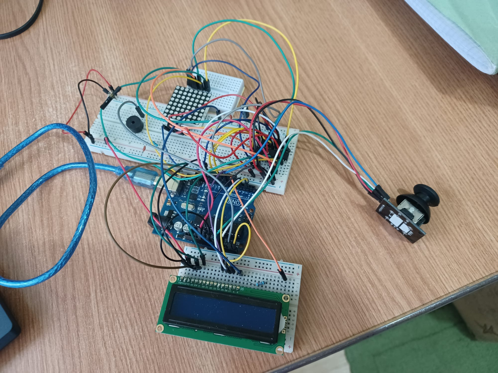
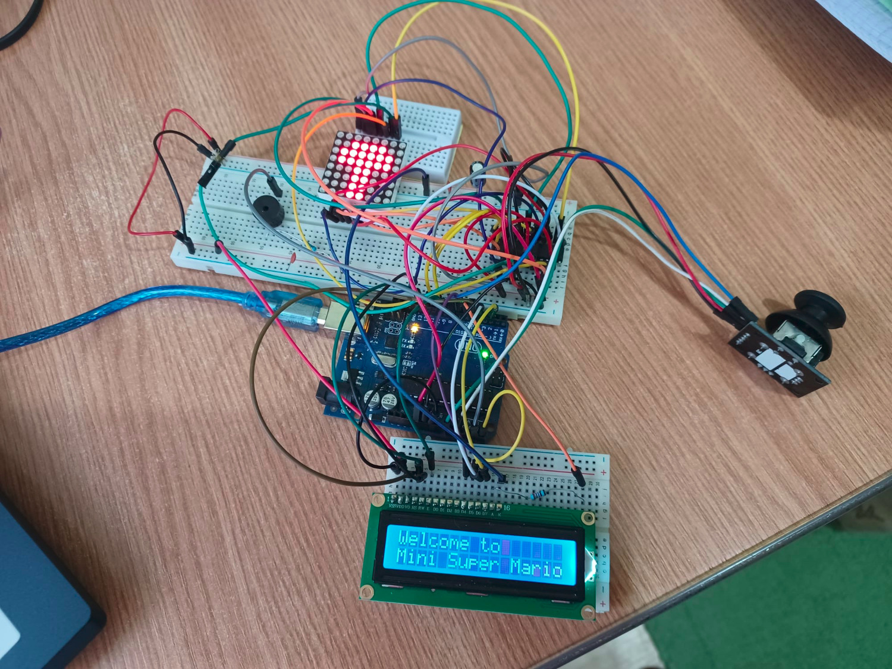

# Mini Super Mario

This project represents a simplified version of the "Super Mario Bros" game on an Arduino UNO board, as part of the "Introduction to Robotics" course taken at the University of Bucharest.

## Backstory and motivation

I have chosen to build this game because I taught that it was a fun game to play even on such a small screen as an 8x8 matrix. 

The game is meant to be a tribute to "Super Mario Bros". Even if the complexity of the game is far from the one of the original Mario, it will prove to be quite challenging.

 

## Game description & How to play

The game consists of 5 levels of difficulty. In each level, Mario is represented as a pixel on the matrix, and the player is supposed to drive him to the end of the map in the shortest possible time.

Along the way, the player will face obstacles, gaps and coins. The difficulty of a level is determined by the frequency of the obstacles and gaps and the available time to finish the level.

Mario can be moved along the horizontal axis using the joystick, and can jump by pressing the button.

A timer will be shown on the LCD, that will indicate the time remaining for the player to finish the level. If the remaining time finishes, the game is finished.

In the beginning, the player has three lives. Each time he falls in a gap, a life is deduced and the player will restart the level, without being granted extra time. If the player remains without any lives, the game ends. The number of lives remaining is also indicated on the LCD.

Each coin the player collects will increase his score. Depending on the level, the coins may have different values. At the end of each level, the score is increased by the remaining time displayed on the LCD.

 

## Used components
 

* 1 8x8 monochromatic led matrix (1088BS)
* 1 matrix driver (MAX7219)
* 1 LCD
* 1 buzzer
* 1 joystick
* 2 ceramic capacitors
* 1 capacitor
* resistors and wires

 

## Setup

 

## Demo

https://www.youtube.com/watch?v=c0cXvdSh9OE